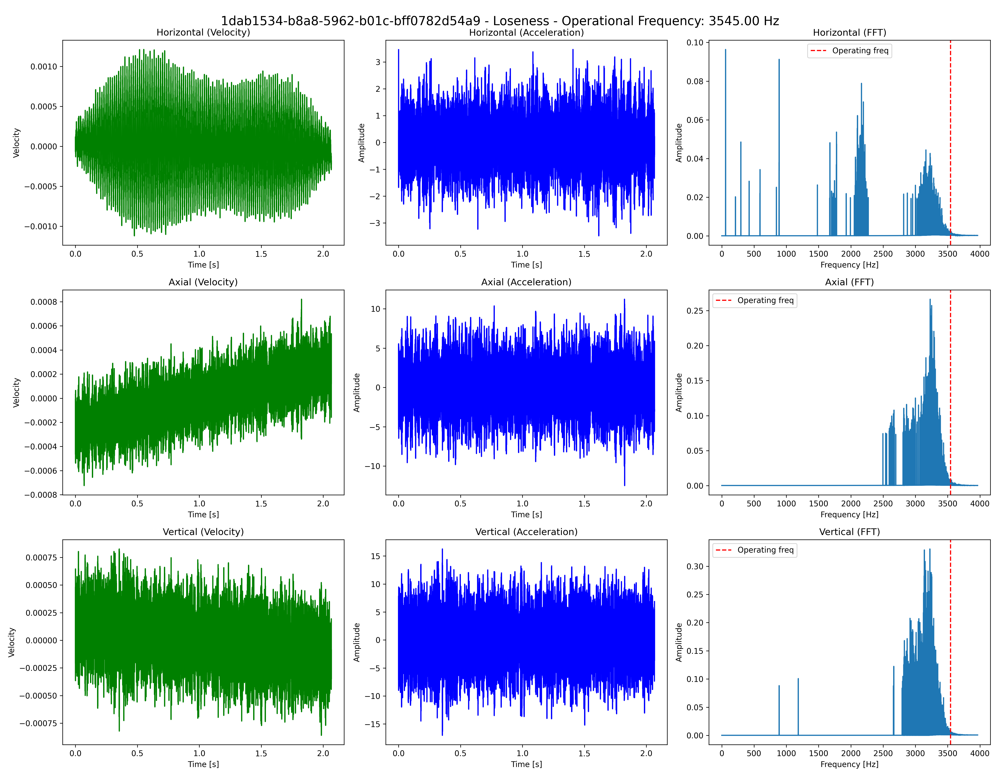
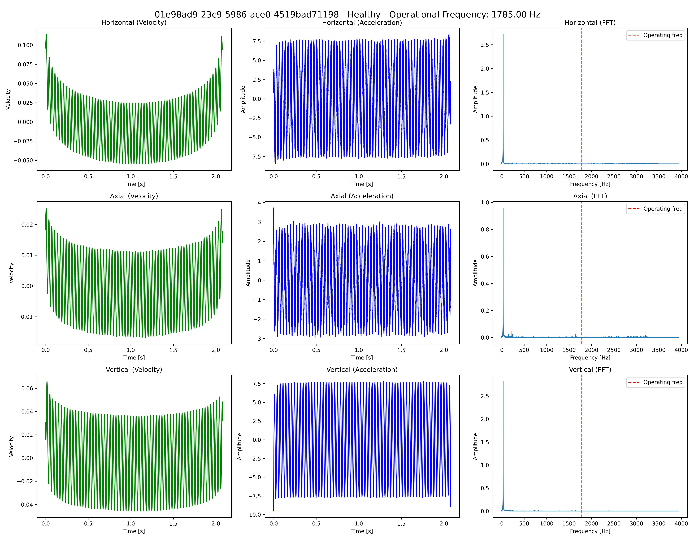

# Tractian Condition Monitoring Challenge

This project aimed to solve two conditions monitoring problems proposed by a TRACTIAN Challenge.
- Lubricant issues detection on bearings based on carpet noise identification
- Motor base bolt loseness detection

---

## Part 1. Lubricant issues detection

The fist problem involved the detection of lubricant issues that can cause distributed wear on the bearings. 

This anomalous condition manifests in the vibration spectrum by generating random noise (background noise), typically in the form of a 'carpet' as it approaches the natural frequencies. Carpet patterns can be perceived as a series of spectral peaks that are randomly close to each other, and its detection is of great importance in order to diagnose lubrication problems. Figure 1 shows an example of a carpet region, along with an illustration of what does not qualify as a carpet—namely, a series of regularly spaced spectral peaks. 


Figure 1. Example of a carpet region. (obtained from TRACTIAN)

In order to solve detect carpet noises in the unlabelled data provided, this project proposed the human in the loop pipeline approach described bellow.

At which a unsupervised machine-learning techinique called Density-Based Spatial Clustering of Applications with Noise (DBSCAN) is used to find high amplitude frequency bands located near each other that could be considered carpet noise regions.These initial regions are filtered using a relative energy based filter, which compares the root mean squared (RMS) of the frequency band selected with the overall signal RMS. If the RMS surpass a high percentage threshold previously defined, the final selected regions are classified as carpet regions.

-This unsupervised pipeline then generates:
- plots of each wave's carpet region selection process (Figure 2 bellow);

- a csv file with features calculated from all regions from a wave signal, wheter they are considered carpet regions or not;

- a plot of these features for all regions, highlighting the regions chosen

-In posession of this files an analyst can further refine the selected regions to train a supervised model approach.


Figure 2. Pipeline solution based on the DBSCAN+ spectral RMS filter

## Part 2. Bolt loseness detection

The second problem involved the detection of losenes in bolts holding a motor to its base. Looseness is a common fault condition that can lead to excessive vibration. Structural looseness typically involves loose bolts in non-rotating components. It is important to address this issue promptly to prevent the development of additional failures caused by the resulting vibrations. 

- Here it was proposed a pipeline for diferent ML models selection:
The code available in train_part2 folder was used to generate data and train the different models using the parameters avalible from Part_2 config.yaml. The models were compared in a validation dataset using a predefined split (available together with other hyperparameters on the Part2_config.yaml file)

```text
│-- train_part2/
│   │-- main.py
│   │-- utils.py
│   │-- pipeline.py
│   │-- models.py
```

-And feature extraction based on the following highly used vibration metrics were used: 
- Root Mean Squared (RMS)
- High pass RMS
- Peak amplitude
- Crest value
- Zero Crossing Rate
- Kurtosis
- Velocity RMS
- Velocity peak to peak
- Velocity signal slope (based on a linear regression)

-This metrics were used both for acceleration and velocity signals. It was observed that although trends are not easily sppoted for acceleration signals the introduction of velocity signal is of great help in loseness condition monitoring, where trends are easily seen.
Figures 3 and 4 are some outputs of the model for diferent conditions. As seen figure 3 posesses a thicker signal which translates in a positive trend in the axial velocity.



Figure 3. Output of the Loseness Model for a motor with bolts lose.



Figure 3. Output of the Loseness Model for a motor fixed.

---

## Project Structure

The project is structured is shown bellow.It is structured in a way that each part of the challenge has one main file that holds the proposed solution. In the case of the first part, this is the ```Unsupervised_Carpet_predictor.py``` file and in the case of the second part it is the ```LosenessDetection.py``` file.Each file has its specific ```Part_N_config.yaml``` that holds hyperparameters and folders locations required to run the file and uses ```Wave.utils.py``` to represent the data as Waves adn CarpetRegions in the case of Part1.

```text
project/
│-- data/
│   │-- part_1/
│   │-- part_2/
│-- outputs/
│   │-- part_1/
│-- train_part2/
│   │-- main.py
│   │-- utils.py
│   │-- pipeline.py
│   │-- models.py
│-- reports/
│   │-- Report_part_1.md
│   │-- Report_part_2.md
│-- Unsupervised_Carpet_Predictor.py
│-- Part1_config.yaml
│-- Loseness_Detection.py
│-- Part2_config.yaml
│-- README.md
│-- requirements.txt
│-- Wave_utils.py
```

## Running the project

In order to run those files it is first necessary to install the dependencies availble in requirements.txt.

```
 pip install -r requirements.txt
```

 Having installed the dependencies each config.yaml file can be modified in order to select the folder with the data. In order to run Part 2 a folder with the trained model and Standart Scaler should also be selected.

 After changing the ```Part1_config.yaml``` file, with the corresponding data folder locations, the ```Unsupervised_Carpet_predictor.py``` is ready to be run using

```
 python Unsupervised_Carpet_predictor.py
```

 The code will read each csv file containg a Wave and will return a list of CarpetRegions, printing in the screen the Wave with most severe carpet noises (based on the sum of the energies of the carpets). Even more, the model will oputput in the desired output folder the decision pipeline process for further checking, the features per regions grouped by te DBSCAN in a csv file and a plot of these features. The outputs of the proposed method are available at 
 
```
│-- outputs/
│   │-- part_1/
```

 Similarly for the ```Part2_config.yaml``` and the ```LosenessDetection.py```:

```
 python LosenessDetection.py
```

 The Loseness detection will be based on the supervised pretained models from folder Part2_train. The chosen model will use aceleration and velocity features described above to dertermine wheter the bolts are lose or not. If modification or retraining is necessary you can modify the code available at the ```train_part2``` folder bellow.

 ```text
│-- train_part2/
│   │-- main.py
│   │-- utils.py
│   │-- pipeline.py
│   │-- models.py
```
and run the ```main.py file```. The expected output from the trainnig pipeline is exihibited bellow:

```text
Feature dataset shape: X=(250, 27), y=(250,)
Saved model StandardScaler to outputs/part_2\StandardScaler.pkl
Saved model RandomForest to outputs/part_2\RandomForest.pkl
Saved model GradientBoosting to outputs/part_2\GradientBoosting.pkl
Saved model SVM to outputs/part_2\SVM.pkl
Saved model LogisticRegression to outputs/part_2\LogisticRegression.pkl
RandomForest Validation Accuracy: 0.980
GradientBoosting Validation Accuracy: 0.980
SVM Validation Accuracy: 0.960
LogisticRegression Validation Accuracy: 0.980
Pipeline finished. Models and plots saved.
```