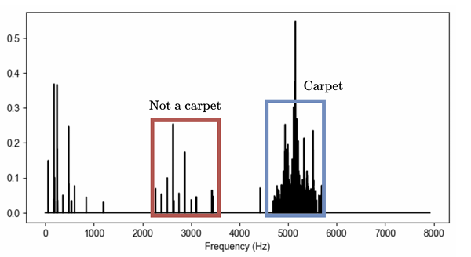

# Tractian Condition Monitoring Challenge

This project aimed to solve two conditions monitoring problems proposed by a TRACTIAN Challenge.
- Lubricant issues detection on bearings based on carpet noise identification
- Motor base bolt loseness detection

---

## Part 1. Lubricant issues detection

The fist problem involved the detection of lubricant issues that can cause distributed wear on the bearings. 

This anomalous condition manifests in the vibration spectrum by generating random noise (background noise), typically in the form of a 'carpet' as it approaches the natural frequencies. Carpet patterns can be perceived as a series of spectral peaks that are randomly close to each other, and its detection is of great importance in order to diagnose lubrication problems. Figure 1 shows an example of a carpet region, along with an illustration of what does not qualify as a carpet—namely, a series of regularly spaced spectral peaks. 



Figure 1. Example of a carpet region. (from TRACTIAN)

In order to solve detect carpet noises in the unlabelled data provided, this project proposed the human in the loop pipeline approach described bellow.

At which a unsupervised machine-learning techinique called Density-Based Spatial Clustering of Applications with Noise (DBSCAN) is used to find initial frequency bands that could be considered carpet noise regions.These initial regions are filtered using a relative energy based filter, which compares the root mean squared (RMS) of the frequency band selected with the overall signal RMS, and sing a high-pass filter with a cutoff of 1kHz. The final selected regions are carpet regions selected by the unsupervised model.

-This unsupervised model generates:
- plots of each wave's carpet region selection process pipeline;

- a csv file with features calculated from all regions from a wave signal, wheter they are considered carpet regions or not;

- a plot of these features for all regions, highlighting the regions chosen

-In posession of this files an analyst can further refine the selected regions to train a supervised model approach.

## Part 2. Bolt loseness detection

The second problem involved the detection of losenes in bolts holding a motor to its base. Looseness is a common fault condition that can lead to excessive vibration. Structural looseness typically involves loose bolts in non-rotating components. It is important to address this issue promptly to prevent the development of additional failures caused by the resulting vibrations. 


## 1. Overview

Provide a slightly more detailed explanation:
- Context / motivation
- High-level approach
- Expected outcome

---

## 2. Methodology

Describe:
- Data sources
- Preprocessing
- Feature engineering
- Models / algorithms used
- Evaluation strategy

---

## 3. Results

Explain your findings.

### Example Figure


Brief explanation of what the figure shows and why it matters.

You can add multiple figures:


---

## 4. Project Structure

```text
project/
│-- data/
│-- figures/
│-- src/
│   │-- main.py
│   │-- utils.py
│-- notebooks/
│-- README.md
│-- requirements.txt